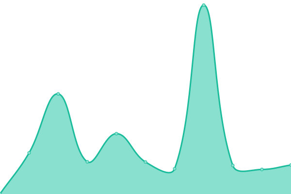

# [📈 Live Status](https://BotSauce.github.io/status): <!--live status--> **🟩 All systems operational**

This repository contains the open-source uptime monitor and status page for [BotSauce](https://botsauce.github.io), powered by [Upptime](https://github.com/upptime/upptime).

With [Upptime](https://upptime.js.org), you can get your own unlimited and free uptime monitor and status page, powered entirely by a GitHub repository. We use [Issues](https://github.com/BotSauce/status/issues) as incident reports, [Actions](https://github.com/BotSauce/status/actions) as uptime monitors, and [Pages](https://BotSauce.github.io/status) for the status page.

<!--start: status pages-->
<!-- This summary is generated by Upptime (https://github.com/upptime/upptime) -->
<!-- Do not edit this manually, your changes will be overwritten -->

| URL                                                                                    | Status | History                                                                                                                          | Response Time                                                                                      | Uptime                                                                                                                                                                                                                                                     |
| -------------------------------------------------------------------------------------- | ------ | -------------------------------------------------------------------------------------------------------------------------------- | -------------------------------------------------------------------------------------------------- | ---------------------------------------------------------------------------------------------------------------------------------------------------------------------------------------------------------------------------------------------------------- |
| BotSauce                                                                               | 🟩 Up  | [bot-sauce.yml](https://github.com/BotSauce/status/commits/master/history/bot-sauce.yml)                                         |  318ms                     |                                          |
| [Discord API (Messages endpoint)](https://discord.com/api/channels/563066002724880404) | 🟩 Up  | [discord-api-messages-endpoint.yml](https://github.com/BotSauce/status/commits/master/history/discord-api-messages-endpoint.yml) |  155ms |  |

<!--end: status pages-->

[**Visit our status website →**](https://BotSauce.github.io/status)

## 📄 License

- Code: [MIT](./LICENSE) © [BotSauce](https://botsauce.github.io)
- Data in the `./history` directory: [Open Database License](https://opendatacommons.org/licenses/odbl/1-0/)
